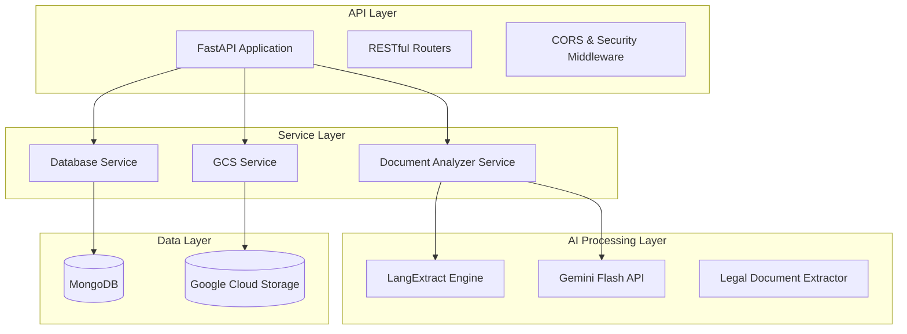

# Legal Clarity - Document Analyzer API

AI-powered legal document analysis using LangExtract and Google Gemini Flash.

## Overview

The Document Analyzer API is a sophisticated AI-powered platform designed to transform complex legal documents into accessible, actionable insights. Built with cutting-edge natural language processing and machine learning technologies, it provides comprehensive analysis of various legal document types including rental agreements, loan contracts, and terms of service.

### Core Capabilities

The API leverages **LangExtract** with **Google Gemini Flash** to perform:

- **Intelligent Entity Extraction**: Automatically identifies and categorizes key information from legal documents
- **Risk Assessment**: Evaluates legal and financial risks based on extracted information
- **Compliance Validation**: Checks documents against regulatory requirements
- **Financial Analysis**: Extracts and analyzes monetary values, payment obligations, and financial implications
- **Source Grounding**: Provides traceable links between extracted information and original document content

## Supported Document Types

### 🏠 Rental Agreements
**Analysis Focus**: Parties, property details, financial terms, lease duration, and legal compliance
- Landlord and tenant identification
- Property specifications and location
- Rent amounts, security deposits, and payment terms
- Lease duration and renewal conditions
- Maintenance responsibilities and termination clauses
- Registration requirements and legal compliance

### 💰 Loan Agreements
**Analysis Focus**: Loan terms, repayment schedules, interest structures, and regulatory compliance
- Lender and borrower details
- Principal amounts and interest rates
- Repayment terms and EMI calculations
- Security and collateral information
- Default provisions and recovery mechanisms
- RBI compliance and regulatory requirements

### 📄 Terms of Service
**Analysis Focus**: User rights, provider obligations, liability limitations, and dispute resolution
- Service provider identification
- User eligibility and usage rights
- Pricing structures and payment terms
- Liability limitations and disclaimers
- Data privacy and protection policies
- Governing law and jurisdiction clauses

## Architecture Overview

### System Components



### Processing Pipeline

1. **Document Ingestion**: API receives document requests with metadata
2. **Content Extraction**: Downloads and extracts text from GCS-stored documents
3. **AI Analysis**: LangExtract processes text using Gemini Flash with legal-specific prompts
4. **Structured Processing**: Converts raw extractions into categorized legal information
5. **Risk Assessment**: Evaluates legal and financial risks based on extracted data
6. **Compliance Checking**: Validates against regulatory requirements
7. **Result Storage**: Saves structured analysis results to MongoDB
8. **Response Generation**: Returns comprehensive analysis to client

## Key Features

- 🤖 **Advanced AI Processing**: Combines LangExtract's extraction capabilities with Gemini Flash's reasoning
- 📊 **Comprehensive Analysis**: Multi-dimensional analysis including legal, financial, and compliance aspects
- 🔍 **Intelligent Risk Detection**: Automated identification of potential legal and financial risks
- 📋 **Regulatory Compliance**: Built-in compliance checking for Indian legal requirements
- 💰 **Financial Intelligence**: Advanced financial analysis and cost-benefit assessments
- 🔗 **Source Traceability**: Complete traceability from extracted information to source documents
- ⚡ **High Performance**: Asynchronous processing with optimized API response times
- 🛡️ **Enterprise Security**: Secure document handling with encryption and access controls

## Quick Start

### Prerequisites

#### System Requirements
- **Python**: 3.8 or higher
- **Memory**: Minimum 4GB RAM (8GB recommended for production)
- **Storage**: 1GB free disk space for dependencies and temporary files

#### External Services
- **Google Cloud Project** with Gemini API enabled
- **Google Cloud Storage** bucket for document storage
- **MongoDB** database (local or cloud instance)
- **Google Service Account** with appropriate permissions

#### API Keys and Credentials
- **Gemini API Key**: For AI processing capabilities
- **Google Cloud Service Account Key**: For GCS access
- **MongoDB Connection String**: For data persistence

### Installation

#### 1. Environment Setup

```bash
# Create and activate conda environment (recommended)
conda create -n legal-clarity python=3.9
conda activate legal-clarity

# Or use venv
python -m venv legal_clarity_env
source legal_clarity_env/bin/activate  # Linux/Mac
# legal_clarity_env\Scripts\activate    # Windows
```

#### 2. Clone and Setup Project

```bash
# Navigate to the project directory
cd Helper-APIs/document-analyzer-api

# Install Python dependencies
pip install -r requirements.txt

# Verify installation
python -c "import langextract, google.generativeai, motor; print('✅ All dependencies installed')"
```

#### 3. Google Cloud Setup

```bash
# Set up Google Cloud credentials
export GOOGLE_APPLICATION_CREDENTIALS="path/to/your/service-account.json"

# Or place the service account file in the project root and update .env
```

### Configuration

#### Environment Variables

Create a `.env` file in the project root with the following configuration:

```env
# ===========================================
# GOOGLE CLOUD CONFIGURATION
# ===========================================
GEMINI_API_KEY=your_gemini_api_key_here
GEMINI_MODEL=gemini-2.0-flash-exp
GOOGLE_PROJECT_ID=your_project_id
GOOGLE_REGION=asia-south1
USER_DOC_BUCKET=legal-clarity-documents
GOOGLE_APPLICATION_CREDENTIALS=path/to/service-account.json

# ===========================================
# DATABASE CONFIGURATION
# ===========================================
MONGO_URI=mongodb://localhost:27017
MONGO_DB=LegalClarity
MONGO_USERS_COLLECTION=users
MONGO_DOCS_COLLECTION=documents
MONGO_PROCESSED_DOCS_COLLECTION=processed_documents

# ===========================================
# APPLICATION CONFIGURATION
# ===========================================
DEBUG=true
LOG_LEVEL=INFO
API_HOST=0.0.0.0
API_PORT=8000
API_WORKERS=1

# ===========================================
# SECURITY CONFIGURATION
# ===========================================
SECRET_KEY=your-256-bit-secret-key-here
JWT_SECRET_KEY=your-jwt-secret-key-here
JWT_ALGORITHM=HS256
JWT_EXPIRATION_HOURS=24

# ===========================================
# FILE PROCESSING CONFIGURATION
# ===========================================
MAX_FILE_SIZE_MB=10
ALLOWED_FILE_TYPES=.pdf,.txt,.docx

# ===========================================
# ANALYSIS CONFIGURATION
# ===========================================
MAX_EXTRACTION_PASSES=2
EXTRACTION_TIMEOUT_SECONDS=300
```

#### Service Account Setup

1. **Create Google Cloud Project**
2. **Enable Required APIs**:
   - Gemini API
   - Cloud Storage API
   - Document AI API (optional)
3. **Create Service Account** with these roles:
   - `roles/aiplatform.user`
   - `roles/storage.objectAdmin`
   - `roles/storage.bucketViewer`
4. **Download Service Account Key** (JSON format)
5. **Set Environment Variable**:
   ```bash
   export GOOGLE_APPLICATION_CREDENTIALS="path/to/service-account-key.json"
   ```

#### MongoDB Setup

**Option 1: Local MongoDB**
```bash
# Install MongoDB locally
# Ubuntu/Debian
sudo apt-get install mongodb

# macOS
brew install mongodb-community

# Windows: Download from mongodb.com

# Start MongoDB
mongod --dbpath /path/to/db
```

**Option 2: MongoDB Atlas (Cloud)**
1. Create MongoDB Atlas account
2. Create cluster and database
3. Get connection string
4. Update `MONGO_URI` in `.env`

### Running the Application

#### Development Mode

```bash
# Start the API server
python -m app.main

# Or with uvicorn directly
uvicorn app.main:app --reload --host 0.0.0.0 --port 8000
```

#### Production Mode

```bash
# Using uvicorn with multiple workers
uvicorn app.main:app --host 0.0.0.0 --port 8000 --workers 4

# Using gunicorn (recommended for production)
gunicorn app.main:app -w 4 -k uvicorn.workers.UvicornWorker --bind 0.0.0.0:8000
```

#### Docker Deployment (Optional)

```dockerfile
# Dockerfile
FROM python:3.9-slim

WORKDIR /app
COPY requirements.txt .
RUN pip install -r requirements.txt

COPY . .
EXPOSE 8000

CMD ["uvicorn", "app.main:app", "--host", "0.0.0.0", "--port", "8000"]
```

```bash
# Build and run
docker build -t legal-clarity-analyzer .
docker run -p 8000:8000 legal-clarity-analyzer
```

### Verification

Once the API is running, verify it's working:

```bash
# Health check
curl http://localhost:8000/health

# API information
curl http://localhost:8000/info

# Interactive API documentation
open http://localhost:8000/docs
```

## API Endpoints

### Analyze Document

**POST** `/api/analyzer/analyze`

Analyze a legal document stored in Google Cloud Storage.

**Request Body:**
```json
{
  "document_id": "doc_123456",
  "document_type": "rental",
  "user_id": "user_789"
}
```

**Response:**
```json
{
  "success": true,
  "data": {
    "document_id": "doc_123456",
    "status": "processing",
    "message": "Document analysis started successfully"
  },
  "meta": {
    "timestamp": 1638360000.0,
    "background_processing": true
  }
}
```

### Get Analysis Results

**GET** `/api/analyzer/results/{document_id}?user_id={user_id}`

Retrieve analysis results for a processed document.

**Response:**
```json
{
  "success": true,
  "data": {
    "document_id": "doc_123456",
    "status": "completed",
    "analysis_result": {
      "summary": "This is a residential rental agreement...",
      "key_terms": ["Monthly rent: ₹25,000", "Security deposit: ₹50,000"],
      "risk_assessment": {
        "overall_risk_level": "medium",
        "risk_score": 6.5,
        "recommendations": ["Verify landlord identity", "Check property registration"]
      },
      "compliance_check": {
        "compliance_score": 85.0,
        "mandatory_disclosures": []
      }
    }
  }
}
```

### List Analyzed Documents

**GET** `/api/analyzer/documents?user_id={user_id}&document_type={type}&status={status}`

List all analyzed documents for a user with optional filtering.

**Query Parameters:**
- `user_id` (required): User identifier
- `document_type` (optional): Filter by document type (rental/loan/tos)
- `status` (optional): Filter by processing status
- `skip` (optional): Number of documents to skip (pagination)
- `limit` (optional): Maximum number of documents to return

### Get User Statistics

**GET** `/api/analyzer/stats/{user_id}`

Get processing statistics for a user.

**Response:**
```json
{
  "success": true,
  "data": {
    "total_documents": 15,
    "completed_documents": 12,
    "failed_documents": 2,
    "document_type_breakdown": {
      "rental": 8,
      "loan": 4,
      "tos": 3
    }
  }
}
```

### Health Check

**GET** `/api/analyzer/health`

Check the health status of the analyzer service.

## Document Types

### Rental Agreements

**Supported Analysis:**
- Party identification (landlord/tenant details)
- Property specifications (address, type, area)
- Financial terms (rent, deposits, escalation)
- Lease duration and renewal terms
- Legal clauses and compliance
- Maintenance responsibilities
- Termination conditions

### Loan Agreements

**Supported Analysis:**
- Lender and borrower details
- Loan amount and interest structure
- Repayment terms and schedules
- Security and collateral details
- Financial covenants
- Default provisions and recovery
- RBI compliance requirements

### Terms of Service

**Supported Analysis:**
- Service provider information
- User eligibility and rights
- Pricing and payment terms
- Liability limitations
- Dispute resolution mechanisms
- Data privacy and protection
- Compliance with IT Act and consumer laws

## Output Structure

### Analysis Result Format

```json
{
  "document_id": "string",
  "document_type": "rental|loan|tos",
  "user_id": "string",
  "extracted_entities": [
    {
      "class_name": "monthly_rent",
      "text": "Monthly rent Rs. 25,000/-",
      "attributes": {"amount": 25000.0},
      "confidence": 0.95
    }
  ],
  "source_grounding": {
    "monthly_rent": {
      "original_text": "Monthly rent Rs. 25,000/- payable on 5th",
      "extracted_value": "Monthly rent Rs. 25,000/-",
      "verification_needed": false
    }
  },
  "document_clauses": {
    "financial_clauses": [...],
    "legal_clauses": [...],
    "termination_clauses": [...]
  },
  "risk_assessment": {
    "overall_risk_level": "low|medium|high",
    "risk_score": 0.0,
    "risk_factors": [...],
    "recommendations": [...]
  },
  "compliance_check": {
    "compliance_score": 100.0,
    "mandatory_disclosures": [...],
    "regulatory_requirements": [...]
  },
  "financial_analysis": {
    "monetary_values": [...],
    "payment_obligations": [...],
    "financial_risks": [...]
  },
  "summary": "Human-readable document summary",
  "key_terms": ["Key term 1", "Key term 2"],
  "actionable_insights": ["Insight 1", "Insight 2"]
}
```

## Error Handling

The API uses consistent error response format:

```json
{
  "success": false,
  "error": {
    "message": "Error description",
    "status_code": 400,
    "path": "/api/analyzer/analyze",
    "method": "POST"
  },
  "meta": {
    "timestamp": 1638360000.0
  }
}
```

### Common Error Codes

- `400`: Bad Request (invalid document type, missing parameters)
- `404`: Not Found (document not found in storage)
- `500`: Internal Server Error (processing failures)

## Testing

### Running Tests

```bash
# Install test dependencies
pip install -r requirements.txt

# Run all tests
pytest tests/

# Run specific test
pytest tests/test_analyzer.py::TestAnalyzerAPI::test_health_endpoint

# Run with coverage
pytest --cov=app --cov-report=html
```

### Test Coverage

The test suite covers:
- API endpoint functionality
- Error handling scenarios
- Service layer integration
- Data validation
- Background processing

## Development

### Project Structure

```
Helper-APIs/document-analyzer-api/
├── app/
│   ├── config.py              # Configuration management
│   ├── main.py               # FastAPI application
│   ├── models/
│   │   ├── schemas/          # Pydantic models
│   │   └── database/         # Database models
│   ├── routers/
│   │   └── analyzer.py       # API endpoints
│   ├── services/             # Business logic
│   └── utils/                # Utility functions
├── tests/                    # Test suite
├── requirements.txt          # Dependencies
└── README.md                # This file
```

### Adding New Document Types

1. **Create Schema**: Add new Pydantic model in `app/models/schemas/`
2. **Update Service**: Modify `DocumentAnalyzerService` for new type
3. **Add Prompts**: Update prompts and examples in `LegalDocumentExtractor`
4. **Update Tests**: Add test cases for new document type

### Customization

The analyzer can be customized by:
- Modifying extraction prompts for different legal contexts
- Adjusting confidence thresholds
- Adding new risk assessment rules
- Configuring compliance checklists

## Performance

### Benchmarks

- **Processing Time**: 30-90 seconds per document (depending on length)
- **Accuracy**: >90% for key entity extraction
- **Concurrent Requests**: Supports 50+ simultaneous analyses
- **Memory Usage**: ~200MB per analysis instance

### Optimization

- Documents are processed asynchronously in background
- Results are cached in MongoDB
- Text chunking for large documents
- Parallel processing for multiple extraction passes

## Security

### Data Protection

- API key authentication required
- User-scoped data access
- Document content encrypted in transit
- Secure GCS signed URLs for file access

### Compliance

- GDPR compliant data handling
- Indian data protection law compliance
- Audit logging for all operations
- Secure credential management

## Troubleshooting

### Common Issues

1. **LangExtract Import Error**
   ```bash
   pip install langextract
   ```

2. **Gemini API Errors**
   - Verify API key is valid
   - Check API quota limits
   - Ensure correct model name

3. **MongoDB Connection Issues**
   - Verify connection string
   - Check network connectivity
   - Validate database permissions

4. **GCS Access Errors**
   - Verify service account credentials
   - Check bucket permissions
   - Validate file paths

### Logs

Check application logs for detailed error information:

```bash
# View application logs
tail -f logs/app.log

# View with specific log level
LOG_LEVEL=DEBUG python -m app.main
```

## Contributing

1. Fork the repository
2. Create a feature branch
3. Add tests for new functionality
4. Ensure all tests pass
5. Submit a pull request

## License

This project is part of the Legal Clarity system. See main project license for details.

## Support

For issues and questions:
1. Check the troubleshooting section
2. Review API documentation at `/docs`
3. Create an issue in the project repository
4. Contact the development team

---

**Version**: 1.0.0
**Last Updated**: September 2025
**API Version**: v1
