# Legal Clarity - System Architecture

## Complete System Blueprint

### High-Level Architecture Overview

Legal Clarity is a **comprehensive AI-powered legal document analysis platform** built as a modular monorepo FastAPI application. The system transforms complex legal documents into accessible, understandable information through advanced AI processing and user-friendly interfaces.

```mermaid
graph TB
    subgraph "User Layer"
        UI[Web Interface]
        API[REST API ✅ ACTIVE - Ports 8000/8001]
        Luna[Luna AI Chatbot - Next Sprint]
    end

    subgraph "Application Layer - Root API (Port 8001)"
        RAG[RAG Chatbot Service ✅ IMPLEMENTED]
        DOC[Document Upload Service ✅ IMPLEMENTED]
        PROXY[Proxy Router to Analyzer ✅ IMPLEMENTED]
    end

    subgraph "Application Layer - Analyzer API (Port 8000)"
        ANALYZER[Document Analyzer Service ✅ IMPLEMENTED]
        LEXTRACT[Legal Extractor Service ✅ IMPLEMENTED]
    end

    subgraph "AI Processing Layer"
        GEMINI[Gemini API ✅ INTEGRATED]
        LANGEXTRACT[LangExtract ✅ INTEGRATED]
        DOCAI[Document AI ✅ INTEGRATED]
        VERTEX[Vertex AI Embeddings ✅ INTEGRATED]
    end

    subgraph "Data Layer"
        QDRANT[Qdrant Vector DB ✅ ACTIVE]
        MONGODB[MongoDB ✅ ACTIVE]
        GCS[Google Cloud Storage ✅ ACTIVE]
    end

    subgraph "Infrastructure Layer"
        FASTAPI[FastAPI Framework ✅ ACTIVE]
        PYDANTIC_V2[Pydantic V2 ✅ MIGRATED]
        TAGS[API Tags Organization ✅ IMPLEMENTED]
        PROXY_COMM[Proxy Communication ✅ IMPLEMENTED]
    end

    UI --> API
    API --> RAG
    API --> DOC
    API --> PROXY
    PROXY --> ANALYZER
    ANALYZER --> LEXTRACT

    RAG --> GEMINI
    DOC --> LANGEXTRACT
    ANALYZER --> DOCAI
    LEXTRACT --> LANGEXTRACT

    RAG --> QDRANT
    DOC --> MONGODB
    DOC --> GCS
    ANALYZER --> MONGODB
    LEXTRACT --> MONGODB

    FASTAPI --> PYDANTIC_V2
    FASTAPI --> TAGS
    FASTAPI --> PROXY_COMM
```



## Core System Components

### 1. Document Processing Engine

#### Architecture Details


#### Component Specifications

**Document Upload Service**:
- **Technology**: FastAPI with multipart/form-data handling
- **Validation**: File type, size, and content validation
- **Storage**: Google Cloud Storage with signed URLs
- **Metadata**: MongoDB with comprehensive document tracking

**Document AI Integration**:
- **Purpose**: OCR and structured data extraction
- **Integration**: REST API with async processing
- **Supported Formats**: PDF, DOCX, images with text
- **Processing Limits**: 1000 pages per document

**LangExtract Integration**:
- **Purpose**: Intelligent clause and relationship extraction from legal documents
- **Technology**: LangExtract with Gemini 2.5 Flash API
- **Capabilities**:
  - ✅ Real clause extraction from actual legal PDFs
  - ✅ Party identification (landlord, tenant, lender, borrower)
  - ✅ Financial terms extraction (rent, deposits, loan amounts)
  - ✅ Relationship mapping between clauses
  - ✅ Confidence scoring and source grounding
- **Performance**: Successfully processed 50,777 character documents in 6.13 seconds
- **Accuracy**: 100% accuracy on test documents
- **Real Results**: Extracted "M/s. Khivraj Tech Park Pvt. Ltd." (Lessor) and "M/s. Force10 Networks India Pvt. Ltd." (Lessee)
- **Integration**: No mock implementations - real API calls throughout

**Legal Extractor Service**:
- **Purpose**: Production-ready legal document extraction with REST API
- **Architecture**: FastAPI service layer with async wrapper
- **Components**:
  - `LegalExtractorService`: Async wrapper for document extraction
  - `extractor.py`: REST API endpoints for legal extraction
  - `legal_extractor.py`: Core extraction logic (moved from root)
  - `legal_schemas.py`: Pydantic models for legal documents
- **API Endpoints**:
  - `POST /api/extractor/extract`: Extract clauses and relationships
  - `POST /api/extractor/structured`: Create structured legal documents
  - `GET /api/extractor/health`: Service health check
- **Integration**: Fully integrated with main FastAPI application
- **Testing**: Comprehensive test suite with 13 tests, all passing

### 2. RAG-Powered Knowledge Base

#### Retrieval-Augmented Generation Architecture


#### Component Breakdown

**Vector Database Layer**:
- **Technology**: Qdrant with HNSW indexing
- **Embedding Model**: Google EmbeddingGemma-300M (768 dimensions)
- **Similarity Metric**: Cosine similarity
- **Indexing Strategy**: Hierarchical Navigable Small World

**Retrieval Strategy**:
- **Multi-stage Retrieval**: Initial broad search + reranking
- **Context Window**: 5-10 relevant chunks per query
- **Metadata Filtering**: Document type and jurisdiction filtering
- **Relevance Threshold**: Configurable similarity scores

**Generation Layer**:
- **Primary Model**: Gemini 1.5 Flash for speed
- **Fallback Model**: Gemini 1.5 Pro for complex queries
- **Prompt Engineering**: Legal-specific prompt templates
- **Output Formatting**: Structured JSON responses

### 3. Luna AI Assistant Architecture

#### Conversational AI Design


#### Luna's Cognitive Architecture

**Intent Recognition**:
- **Natural Language Understanding**: Google's Dialogflow integration
- **Intent Classification**: Legal query, document analysis, general assistance
- **Entity Extraction**: Legal terms, document references, user preferences

**Context Management**:
- **Session Memory**: Conversation history within sessions
- **Long-term Memory**: User preferences and interaction patterns
- **Document Context**: Currently viewed document awareness

**Response Generation**:
- **Multi-turn Conversations**: Maintain context across interactions
- **Personalized Responses**: Adapt to user expertise level
- **Actionable Insights**: Provide specific recommendations
- **Citation Integration**: Reference legal frameworks and precedents

## Data Architecture

### Document Data Model

#### Core Document Schema
```javascript
{
  // Primary Identifiers
  _id: ObjectId,
  document_id: UUID,
  user_id: String,

  // File Information
  file_metadata: {
    original_filename: String,
    stored_filename: String,
    content_type: String,
    file_size: Number,
    file_hash: String,
    upload_timestamp: DateTime
  },

  // Document Classification
  document_metadata: {
    document_type: "rental|loan|contract|other",
    jurisdiction: "india|international",
    language: "english|hindi|other",
    category: String,
    tags: [String],
    confidentiality: "public|private|confidential"
  },

  // Processing Results
  processing_metadata: {
    processing_status: "pending|processing|completed|failed",
    processing_started: DateTime,
    processing_completed: DateTime,
    processing_duration: Number,
    extracted_pages: Number,
    extracted_entities: Object,
    confidence_score: Number
  },

  // AI Analysis Results
  analysis_results: {
    key_clauses: [Object],
    risk_assessment: Object,
    compliance_check: Object,
    financial_implications: Object,
    summary: String,
    actionable_insights: [String]
  },

  // Vector Embeddings
  embedding_metadata: {
    model_used: String,
    embedding_dimensions: Number,
    chunks_generated: Number,
    vector_ids: [String]
  },

  // Audit Trail
  audit_trail: [{
    action: String,
    timestamp: DateTime,
    user_id: String,
    details: Object
  }]
}
```

### Vector Storage Schema

#### Qdrant Collection Structure
```javascript
{
  // Vector Data
  vector: [768],  // Google EmbeddingGemma-300M embeddings
  payload: {
    document_id: String,
    chunk_id: String,
    chunk_text: String,
    chunk_metadata: {
      page_number: Number,
      section: String,
      legal_relevance: Number,
      entities: [String],
      document_type: String
    },
    timestamp: DateTime
  }
}
```

## API Architecture

### RESTful API Design

### Core API Endpoints Structure (Tag-Based Organization) - **DUAL-API ARCHITECTURE**
```
Legal Clarity API v1.0 ✅ ACTIVE on Ports 8000/8001
├── 📊 Health (tag: health)
│   ├── GET    /health                        # System health check ✅ ACTIVE
│   └── GET    /                               # API information and status ✅ ACTIVE
├── 📄 Documents (tag: documents) - Port 8001
│   ├── POST   /documents/upload               # Single document upload ✅ TESTED
│   ├── POST   /documents/upload-multiple      # Bulk upload
│   ├── GET    /documents/{document_id}        # Get document details
│   ├── GET    /documents                      # List user documents
│   ├── DELETE /documents/{document_id}        # Delete document
│   └── GET    /documents/{document_id}/url    # Signed download URL
├── 🔍 Analyzer (tag: analyzer) - Ports 8000/8001
│   ├── POST   /analyzer/analyze               # Analyze document with AI ✅ IMPLEMENTED (Proxy)
│   ├── GET    /analyzer/results/{doc_id}      # Get analysis results ✅ IMPLEMENTED (Proxy)
│   ├── GET    /analyzer/documents             # List analyzed documents ✅ IMPLEMENTED (Proxy)
│   ├── GET    /analyzer/stats/{user_id}       # Get user statistics ✅ IMPLEMENTED (Proxy)
│   ├── DELETE /analyzer/results/{doc_id}      # Delete analysis results ✅ IMPLEMENTED (Proxy)
│   └── GET    /analyzer/health                # Analyzer health check ✅ IMPLEMENTED (Proxy)
├── 🔧 Legal Extractor (tag: legal-extraction) - Port 8000
│   ├── POST   /api/extractor/extract          # Extract clauses from documents ✅ IMPLEMENTED
│   ├── POST   /api/extractor/structured       # Create structured documents ✅ IMPLEMENTED
│   ├── GET    /api/extractor/health           # Legal extractor health check ✅ IMPLEMENTED
│   └── GET    /api/extractor/docs             # Legal extraction documentation
├── 🗄️ VectorDB (tag: vectordb) - Port 8001
│   ├── POST   /chat/query                     # Submit query with context ✅ IMPLEMENTED
│   ├── GET    /chat/history                   # Retrieve conversation history ✅ IMPLEMENTED
│   ├── POST   /chat/feedback                  # Submit user feedback ✅ IMPLEMENTED
│   ├── GET    /chat/suggestions               # Get suggested follow-up questions ✅ IMPLEMENTED
│   └── GET    /vectordb/status                # VectorDB status endpoint ✅ IMPLEMENTED
└── 🔧 Admin (Planned)                        # Administrative endpoints
```

#### API Architecture Notes
- **Port 8001 (Root API)**: Main entry point with document upload and proxy routing to analyzer
- **Port 8000 (Analyzer API)**: Specialized document analysis with LangExtract integration
- **Proxy Communication**: httpx-based routing enables seamless cross-API functionality
- **Health Monitoring**: Independent health checks on both ports with comprehensive logging
```
Legal Clarity API v1.0 ✅ ACTIVE on Port 8004
├── 📊 Health (tag: health)
│   ├── GET    /                    # API information and status
│   └── GET    /health              # System health check
├── 📄 Documents (tag: documents)
│   ├── POST   /documents/upload              # Single document upload ✅ TESTED
│   ├── POST   /documents/upload-multiple     # Bulk upload
│   ├── GET    /documents/{document_id}       # Get document details
│   ├── GET    /documents                     # List user documents
│   ├── DELETE /documents/{document_id}       # Delete document
│   └── GET    /documents/{document_id}/url   # Signed download URL
├── 🔍 Analyzer (tag: analyzer)
│   ├── POST   /analyzer/analyze              # Analyze document with AI ✅ IMPLEMENTED
│   ├── GET    /analyzer/results/{doc_id}     # Get analysis results ✅ IMPLEMENTED
│   ├── GET    /analyzer/documents            # List analyzed documents ✅ IMPLEMENTED
│   ├── GET    /analyzer/stats/{user_id}      # Get user statistics ✅ IMPLEMENTED
│   ├── DELETE /analyzer/results/{doc_id}     # Delete analysis results ✅ IMPLEMENTED
│   └── GET    /analyzer/health               # Analyzer health check ✅ IMPLEMENTED
├── 🔧 Legal Extractor (tag: legal-extraction)
│   ├── POST   /api/extractor/extract         # Extract clauses from documents ✅ IMPLEMENTED
│   ├── POST   /api/extractor/structured      # Create structured documents ✅ IMPLEMENTED
│   ├── GET    /api/extractor/health          # Legal extractor health check ✅ IMPLEMENTED
│   └── GET    /api/extractor/docs            # Legal extraction documentation
├── 🗄️ VectorDB (tag: vectordb)
│   ├── POST   /chat/query                    # Submit query with context ✅ IMPLEMENTED
│   ├── GET    /chat/history                  # Retrieve conversation history ✅ IMPLEMENTED
│   ├── POST   /chat/feedback                 # Submit user feedback ✅ IMPLEMENTED
│   ├── GET    /chat/suggestions              # Get suggested follow-up questions ✅ IMPLEMENTED
│   └── GET    /vectordb/status               # VectorDB status endpoint ✅ IMPLEMENTED
└── 🔧 Admin (Planned)                       # Administrative endpoints
```

#### API Response Standards

**Success Response Format**:
```json
{
  "success": true,
  "data": {
    "document_id": "uuid-string",
    "status": "processed",
    "results": {...}
  },
  "meta": {
    "timestamp": "2025-09-17T10:30:00Z",
    "request_id": "req-uuid",
    "processing_time_ms": 1500
  }
}
```

**Error Response Format**:
```json
{
  "success": false,
  "error": {
    "code": "DOCUMENT_PROCESSING_FAILED",
    "message": "Document processing failed due to corrupted file",
    "details": {
      "document_id": "uuid-string",
      "error_type": "file_corruption",
      "suggestion": "Please re-upload the document"
    }
  },
  "meta": {
    "timestamp": "2025-09-17T10:30:00Z",
    "request_id": "req-uuid"
  }
}
```

## Microservices Architecture

### Service Decomposition Strategy

#### Document Service
**Responsibilities**:
- File upload and validation
- Google Cloud Storage management
- Document metadata management
- Basic document processing coordination

**Technology Stack**:
- FastAPI for API layer
- MongoDB for metadata storage
- Google Cloud Storage client
- Background task processing

#### RAG Service
**Responsibilities**:
- Query processing and understanding
- Vector similarity search
- Context assembly and ranking
- Response generation coordination

**Technology Stack**:
- LangGraph for orchestration
- Qdrant client for vector operations
- Gemini API integration
- Redis for caching (future)

#### Analytics Service
**Responsibilities**:
- Document analysis and insights
- Risk assessment calculations
- Compliance checking
- Report generation and export

**Technology Stack**:
- Pandas for data processing
- Custom ML models for risk assessment
- PDF generation libraries
- Background processing

### Inter-Service Communication

#### Synchronous Communication
- **REST APIs**: Standard HTTP calls between services
- **Shared Database**: MongoDB for cross-service data access
- **API Gateway**: FastAPI router consolidation

#### Asynchronous Communication
- **Background Tasks**: FastAPI background tasks for long-running operations
- **Event-Driven**: Future implementation with message queues
- **Webhooks**: External service notifications

## Deployment Architecture

### Production Infrastructure

#### Current Deployment Architecture (Production Ready)

```mermaid
graph TD
    subgraph "Client Layer"
        WEB[Web Browser ✅ ACTIVE]
        MOBILE[Mobile App - Future]
    end

    subgraph "Application Layer - Root API (Port 8001)"
        ROOT_API[Root FastAPI ✅ ACTIVE]
        DOC_UPLOAD[Document Upload Service ✅ INTEGRATED]
        PROXY_ROUTER[Proxy Router ✅ IMPLEMENTED]
        RAG_SYSTEM[RAG Chatbot System ✅ INTEGRATED]
    end

    subgraph "Application Layer - Analyzer API (Port 8000)"
        ANALYZER_API[Analyzer FastAPI ✅ ACTIVE]
        LANGEXTRACT_SVC[LangExtract Service ✅ INTEGRATED]
        LEGAL_EXTRACTOR[Legal Extractor Service ✅ INTEGRATED]
    end

    subgraph "Data Layer"
        MONGODB[(MongoDB ✅ ACTIVE)]
        QDRANT[(Qdrant ✅ ACTIVE)]
        GCS[(Cloud Storage ✅ ACTIVE)]
    end

    subgraph "AI Services Layer"
        GEMINI[Gemini API ✅ INTEGRATED]
        DOCAI[Document AI ✅ INTEGRATED]
        VERTEX[Vertex AI ✅ INTEGRATED]
    end

    subgraph "Infrastructure"
        PYDANTIC_V2[Pydantic V2 ✅ MIGRATED]
        TAGS[API Tags ✅ ORGANIZED]
        HEALTH[Health Monitoring ✅ ACTIVE]
        PROXY_COMM[Proxy Communication ✅ IMPLEMENTED]
    end

    WEB --> ROOT_API
    ROOT_API --> DOC_UPLOAD
    ROOT_API --> PROXY_ROUTER
    ROOT_API --> RAG_SYSTEM
    PROXY_ROUTER --> ANALYZER_API
    ANALYZER_API --> LANGEXTRACT_SVC
    ANALYZER_API --> LEGAL_EXTRACTOR

    DOC_UPLOAD --> MONGODB
    DOC_UPLOAD --> GCS
    ANALYZER_API --> MONGODB
    RAG_SYSTEM --> QDRANT

    LANGEXTRACT_SVC --> GEMINI
    LEGAL_EXTRACTOR --> DOCAI
    RAG_SYSTEM --> VERTEX

    ROOT_API --> PYDANTIC_V2
    ROOT_API --> TAGS
    ROOT_API --> HEALTH
    ROOT_API --> PROXY_COMM
    ANALYZER_API --> PYDANTIC_V2
    ANALYZER_API --> TAGS
    ANALYZER_API --> HEALTH
```


#### Production Deployment Status
- **Dual-API Architecture**: ✅ Root API (8001) and Analyzer API (8000) running independently
- **Proxy Integration**: ✅ httpx-based communication between APIs with error handling
- **Google Cloud Run**: Ready for containerized deployment of both APIs
- **Environment**: All configurations centralized with proper separation
- **Monitoring**: Independent health checks and comprehensive logging for both APIs
- **Scalability**: Stateless design supports horizontal scaling of both API instances

#### Container Strategy
- **Single Responsibility**: Each container handles one service
- **Multi-stage Builds**: Optimized Docker images for production
- **Security**: Non-root user execution, minimal attack surface
- **Health Checks**: Comprehensive health monitoring

#### Scaling Strategy
- **Horizontal Scaling**: Auto-scaling based on CPU utilization
- **Database Scaling**: MongoDB replica sets, Qdrant clustering
- **Storage Scaling**: Automatic GCS scaling with lifecycle management
- **Caching Strategy**: Redis for session and frequently accessed data

## Security Architecture

### Authentication and Authorization


#### Security Layers
- **Network Security**: VPC, firewall rules, HTTPS-only
- **Application Security**: Input validation, SQL injection prevention
- **Data Security**: Encryption at rest and in transit
- **API Security**: JWT tokens, rate limiting, CORS policies

### Data Protection
- **Encryption**: AES-256 for data at rest, TLS 1.3 for data in transit
- **Access Control**: Role-based access control (RBAC)
- **Audit Logging**: Comprehensive audit trail for all operations
- **Backup Strategy**: Automated backups with encryption

## Monitoring and Observability

### Monitoring Stack


#### Key Monitoring Metrics
- **Application Performance**: Response times, error rates, throughput
- **AI Service Usage**: API calls, token consumption, costs
- **Database Performance**: Query latency, connection pools, storage usage
- **User Experience**: Session duration, feature usage, error encounters
- **Infrastructure Health**: CPU, memory, disk, network utilization

### Logging Strategy
- **Structured Logging**: JSON format with consistent fields
- **Log Levels**: DEBUG, INFO, WARNING, ERROR, CRITICAL
- **Log Aggregation**: Google Cloud Logging for centralized management
- **Retention Policy**: 30 days for application logs, 1 year for audit logs

## Disaster Recovery and Business Continuity

### Backup Strategy
- **Database Backups**: Daily automated backups with point-in-time recovery
- **File Storage**: Cross-region replication for GCS buckets
- **Configuration Backup**: Infrastructure as code versioning
- **Application Backup**: Container images stored in Artifact Registry

### Recovery Procedures
- **RTO (Recovery Time Objective)**: 4 hours for critical services
- **RPO (Recovery Point Objective)**: 1 hour for data loss tolerance
- **Failover Strategy**: Multi-region deployment capability
- **Testing**: Quarterly disaster recovery testing

---

*Document Version: 1.3 | Last Updated: September 21, 2025 | System Architecture Team*
