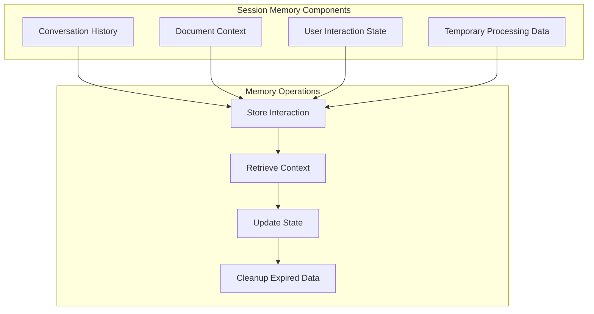
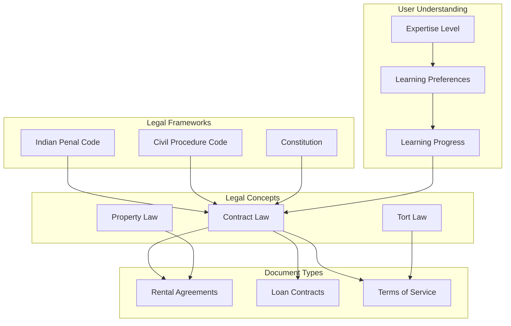
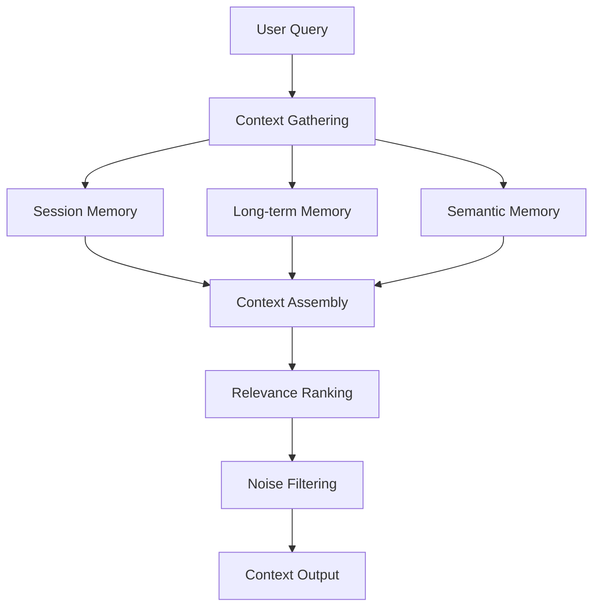

# Legal Clarity - LangMem Memory System

## LangMem-Compatible Memory Architecture

### Overview

Legal Clarity implements a sophisticated memory system designed to enhance user experience through personalized, context-aware interactions. The system leverages LangMem principles to create persistent, evolving memory structures that adapt to user preferences and interaction patterns.

## Core Memory Components

### 1. Session Memory Layer

#### Purpose and Functionality
The session memory layer maintains context within individual user sessions, enabling coherent multi-turn conversations and document analysis workflows.



#### Implementation Details

**Conversation History**:
- **Storage**: Redis with TTL (Time-To-Live) expiration
- **Structure**: Chronological message sequence with metadata
- **Retention**: 24 hours for active sessions, 7 days for inactive
- **Indexing**: User ID and session ID for fast retrieval

**Document Context**:
- **Purpose**: Maintain awareness of currently analyzed documents
- **Data**: Document ID, section references, user annotations
- **Persistence**: Session duration with automatic cleanup
- **Integration**: Seamless switching between document analysis tasks

**User Interaction State**:
- **Preferences**: UI settings, response verbosity, analysis depth
- **Workflow State**: Multi-step analysis progress tracking
- **Temporary Data**: Processing results, intermediate calculations

### 2. Long-Term Memory Layer

#### User Profile Memory
```javascript
{
  user_id: "uuid-string",
  profile: {
    expertise_level: "beginner|intermediate|advanced",
    preferred_language: "english|hindi",
    document_types: ["rental", "loan", "contract"],
    interaction_patterns: {
      average_session_duration: 1200,  // seconds
      preferred_features: ["chat", "analytics", "timeline"],
      common_queries: ["risk assessment", "clause explanation"]
    },
    learning_progress: {
      legal_terms_learned: 45,
      documents_analyzed: 23,
      comprehension_improvement: 0.75
    }
  },
  preferences: {
    response_length: "concise|detailed",
    risk_tolerance: "conservative|balanced|aggressive",
    notification_settings: Object,
    privacy_settings: Object
  },
  history: {
    total_sessions: 156,
    total_queries: 1247,
    favorite_documents: ["doc-uuid-1", "doc-uuid-2"],
    saved_analyses: ["analysis-uuid-1"]
  }
}
```

#### Document Memory Network
```javascript
{
  document_id: "uuid-string",
  memory_graph: {
    user_interactions: [{
      user_id: "user-uuid",
      interaction_type: "analysis|query|annotation",
      timestamp: "2025-09-17T10:30:00Z",
      context: {
        sections_viewed: ["section-1", "section-3"],
        queries_asked: ["What does this clause mean?"],
        insights_found: ["High-risk clause identified"]
      }
    }],
    collaborative_insights: [{
      insight_type: "risk_pattern|legal_precedent",
      confidence_score: 0.85,
      user_contributions: ["user-1", "user-2"],
      validation_status: "verified|pending"
    }],
    evolution_history: [{
      version: 1,
      changes: "Initial analysis completed",
      timestamp: "2025-09-17T08:00:00Z"
    }]
  },
  semantic_memory: {
    key_concepts: ["specific_performance", "liquidated_damages"],
    related_documents: ["related-doc-1", "related-doc-2"],
    legal_frameworks: ["indian_contract_act", "specific_relief_act"]
  }
}
```

### 3. Semantic Memory Layer

#### Knowledge Graph Structure


#### Vector Memory Implementation

**Embedding Strategy**:
- **Model**: Google EmbeddingGemma-300M (768 dimensions)
- **Chunking**: Legal-specific text segmentation
- **Indexing**: Qdrant with HNSW algorithm
- **Similarity**: Cosine similarity with threshold filtering

**Memory Retrieval Patterns**:
```python
class SemanticMemory:
    def retrieve_relevant_memories(
        self,
        query: str,
        user_context: UserContext,
        similarity_threshold: float = 0.7
    ) -> List[MemoryChunk]:

        # Generate query embedding
        query_embedding = self.embedding_model.encode(query)

        # Retrieve similar memories
        search_results = self.vector_db.search(
            collection_name="user_memories",
            query_vector=query_embedding,
            filter={
                "user_id": user_context.user_id,
                "memory_type": "semantic"
            },
            limit=10,
            score_threshold=similarity_threshold
        )

        # Rank and filter results
        ranked_memories = self.rank_memories(
            search_results,
            user_context,
            query
        )

        return ranked_memories
```

## Memory Integration Patterns

### Context Assembly Pipeline



### Personalized Response Generation

```python
class PersonalizedResponseGenerator:
    def generate_response(
        self,
        query: str,
        user_context: UserContext,
        retrieved_memories: List[MemoryChunk]
    ) -> str:

        # Adapt response based on user expertise
        if user_context.expertise_level == "beginner":
            response_style = "simple_explanation"
            include_examples = True
        elif user_context.expertise_level == "advanced":
            response_style = "detailed_analysis"
            include_examples = False

        # Incorporate memory insights
        memory_insights = self.extract_insights(retrieved_memories)

        # Generate personalized response
        response = self.ai_model.generate(
            query=query,
            context=user_context,
            memories=memory_insights,
            style=response_style,
            include_examples=include_examples
        )

        # Update memory with new interaction
        self.update_memory(user_context, query, response)

        return response
```

## Memory Lifecycle Management

### Memory Creation and Storage

```python
class MemoryManager:
    async def create_memory(
        self,
        user_id: str,
        memory_type: str,
        content: dict,
        metadata: dict = None
    ) -> str:

        memory_id = str(uuid.uuid4())

        # Create memory document
        memory_doc = {
            "_id": memory_id,
            "user_id": user_id,
            "memory_type": memory_type,
            "content": content,
            "metadata": metadata or {},
            "created_at": datetime.utcnow(),
            "last_accessed": datetime.utcnow(),
            "access_count": 0,
            "importance_score": self.calculate_importance(content)
        }

        # Store in appropriate storage
        if memory_type == "session":
            await self.session_store.store(memory_id, memory_doc)
        elif memory_type == "long_term":
            await self.long_term_store.store(memory_doc)
        elif memory_type == "semantic":
            # Generate embeddings for semantic memory
            embedding = self.embedding_model.encode(
                self.extract_text_content(content)
            )
            await self.vector_store.store(
                memory_id,
                embedding,
                memory_doc
            )

        return memory_id
```

### Memory Retrieval and Ranking

```python
class MemoryRetrieval:
    async def retrieve_memories(
        self,
        user_id: str,
        query: str,
        context: dict,
        limit: int = 5
    ) -> List[MemoryResult]:

        # Multi-stage retrieval
        candidates = []

        # 1. Semantic similarity search
        semantic_results = await self.semantic_search(query, user_id, limit * 2)
        candidates.extend(semantic_results)

        # 2. Contextual retrieval
        contextual_results = await self.contextual_search(context, user_id, limit)
        candidates.extend(contextual_results)

        # 3. Recent interaction retrieval
        recent_results = await self.recent_search(user_id, limit)
        candidates.extend(recent_results)

        # 4. Collaborative filtering
        collaborative_results = await self.collaborative_search(
            user_id,
            query,
            limit
        )
        candidates.extend(collaborative_results)

        # Rank and deduplicate
        ranked_results = self.rank_and_deduplicate(candidates)

        # Update access patterns
        await self.update_access_patterns(user_id, ranked_results)

        return ranked_results[:limit]
```

### Memory Evolution and Learning

```python
class MemoryEvolution:
    async def evolve_memory(
        self,
        user_id: str,
        interaction_data: dict
    ) -> None:

        # Analyze interaction patterns
        patterns = self.analyze_patterns(interaction_data)

        # Update user profile
        await self.update_user_profile(user_id, patterns)

        # Strengthen important memories
        await self.strengthen_memories(user_id, patterns)

        # Create new semantic connections
        await self.create_connections(user_id, interaction_data)

        # Prune irrelevant memories
        await self.prune_memories(user_id)

    def analyze_patterns(self, interaction_data: dict) -> dict:
        """Analyze user interaction patterns for memory evolution"""
        return {
            "preferred_topics": self.extract_topics(interaction_data),
            "learning_style": self.identify_learning_style(interaction_data),
            "expertise_growth": self.measure_expertise_growth(interaction_data),
            "attention_patterns": self.analyze_attention(interaction_data)
        }
```

## Memory Privacy and Security

### Privacy Protection Mechanisms

```python
class MemoryPrivacy:
    def __init__(self):
        self.encryption = EncryptionManager()
        self.access_control = AccessControlManager()
        self.audit_logger = AuditLogger()

    async def store_sensitive_memory(
        self,
        user_id: str,
        content: dict,
        privacy_level: str
    ) -> str:

        # Encrypt sensitive content
        encrypted_content = self.encryption.encrypt(content)

        # Apply privacy filters
        filtered_content = self.apply_privacy_filters(
            encrypted_content,
            privacy_level
        )

        # Store with access controls
        memory_id = await self.secure_store(
            user_id,
            filtered_content,
            privacy_level
        )

        # Log access for audit
        await self.audit_logger.log_memory_creation(
            user_id,
            memory_id,
            privacy_level
        )

        return memory_id

    def apply_privacy_filters(self, content: dict, privacy_level: str) -> dict:
        """Apply privacy filters based on privacy level"""
        if privacy_level == "high":
            # Remove all personal information
            return self.remove_personal_info(content)
        elif privacy_level == "medium":
            # Anonymize personal information
            return self.anonymize_personal_info(content)
        else:
            # Low privacy - minimal filtering
            return content
```

### Memory Access Control

```python
class MemoryAccessControl:
    def check_memory_access(
        self,
        user_id: str,
        memory_id: str,
        access_type: str
    ) -> bool:

        # Verify ownership
        if not self.verify_ownership(user_id, memory_id):
            return False

        # Check privacy settings
        privacy_settings = self.get_privacy_settings(user_id)

        # Verify access permissions
        if not self.verify_permissions(user_id, memory_id, access_type):
            await self.log_access_denial(user_id, memory_id, access_type)
            return False

        # Check temporal restrictions
        if not self.check_temporal_access(memory_id):
            return False

        # Log successful access
        await self.log_access_grant(user_id, memory_id, access_type)

        return True
```

## Performance Optimization

### Memory Caching Strategy

```python
class MemoryCache:
    def __init__(self, redis_client, local_cache_size: int = 1000):
        self.redis = redis_client
        self.local_cache = LRUCache(local_cache_size)
        self.cache_strategy = AdaptiveCacheStrategy()

    async def get_memory(
        self,
        memory_id: str,
        user_id: str
    ) -> Optional[dict]:

        # Check local cache first
        cached = self.local_cache.get(f"{user_id}:{memory_id}")
        if cached:
            await self.update_access_time(memory_id)
            return cached

        # Check Redis cache
        redis_key = f"memory:{user_id}:{memory_id}"
        cached = await self.redis.get(redis_key)
        if cached:
            # Update local cache
            self.local_cache.put(f"{user_id}:{memory_id}", cached)
            await self.update_access_time(memory_id)
            return cached

        # Fetch from primary storage
        memory = await self.primary_storage.get_memory(memory_id, user_id)
        if memory:
            # Cache for future use
            await self.cache_memory(memory_id, user_id, memory)

        return memory
```

### Memory Indexing and Search Optimization

```python
class MemoryIndex:
    def __init__(self, vector_db, search_engine):
        self.vector_db = vector_db
        self.search_engine = search_engine
        self.index_optimizer = IndexOptimizer()

    async def optimize_search_index(self, user_id: str) -> None:
        """Optimize memory search index for user"""

        # Analyze query patterns
        query_patterns = await self.analyze_query_patterns(user_id)

        # Optimize vector index
        await self.optimize_vector_index(user_id, query_patterns)

        # Update search rankings
        await self.update_search_rankings(user_id, query_patterns)

        # Rebuild inverted index if needed
        if self.should_rebuild_index(user_id):
            await self.rebuild_inverted_index(user_id)

    async def hybrid_search(
        self,
        query: str,
        user_id: str,
        semantic_weight: float = 0.7,
        keyword_weight: float = 0.3
    ) -> List[SearchResult]:

        # Perform semantic search
        semantic_results = await self.vector_search(query, user_id)

        # Perform keyword search
        keyword_results = await self.keyword_search(query, user_id)

        # Combine results with weights
        combined_results = self.combine_results(
            semantic_results,
            keyword_results,
            semantic_weight,
            keyword_weight
        )

        # Apply user-specific ranking
        personalized_results = await self.apply_personalization(
            combined_results,
            user_id
        )

        return personalized_results
```

## Monitoring and Analytics

### Memory System Metrics

```python
class MemoryMetrics:
    def __init__(self):
        self.metrics_collector = MetricsCollector()

    async def collect_memory_metrics(self, user_id: str) -> dict:
        """Collect comprehensive memory system metrics"""

        return {
            "storage_metrics": await self.get_storage_metrics(user_id),
            "performance_metrics": await self.get_performance_metrics(user_id),
            "usage_metrics": await self.get_usage_metrics(user_id),
            "quality_metrics": await self.get_quality_metrics(user_id),
            "privacy_metrics": await self.get_privacy_metrics(user_id)
        }

    async def get_storage_metrics(self, user_id: str) -> dict:
        """Get memory storage utilization metrics"""
        return {
            "total_memories": await self.count_memories(user_id),
            "storage_size": await self.calculate_storage_size(user_id),
            "memory_types_distribution": await self.get_memory_types_distribution(user_id),
            "retention_rates": await self.calculate_retention_rates(user_id)
        }

    async def get_performance_metrics(self, user_id: str) -> dict:
        """Get memory system performance metrics"""
        return {
            "average_retrieval_time": await self.calculate_avg_retrieval_time(user_id),
            "cache_hit_rate": await self.calculate_cache_hit_rate(user_id),
            "search_accuracy": await self.calculate_search_accuracy(user_id),
            "memory_access_patterns": await self.analyze_access_patterns(user_id)
        }
```

---

*Document Version: 1.0 | Last Updated: September 2025 | Memory Systems Team*
