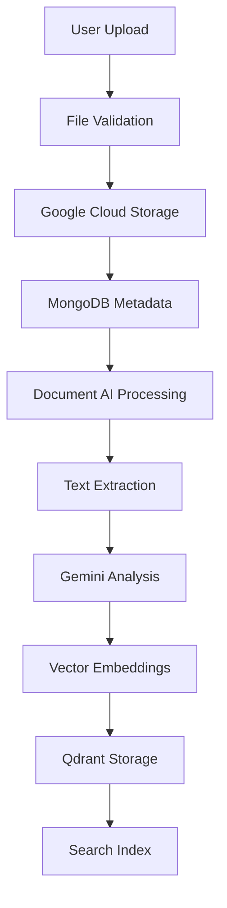

# Legal Clarity - Technical Context

## Technology Stack Overview

### Core Architecture
Legal Clarity is built as a **monorepo FastAPI application** with modular components for document processing, RAG-powered chatbots, and vector database operations. The architecture leverages Google Cloud's generative AI stack integrated with modern Python frameworks.

### Primary Technology Components

#### Backend Framework
- **FastAPI**: High-performance async web framework for Python ✅ IMPLEMENTED
- **Python 3.8+**: Core programming language with async/await support ✅ ACTIVE
- **Uvicorn**: ASGI server for production deployment ✅ ACTIVE (Port 8004)
- **Pydantic V2**: Complete migration with model_config dictionaries ✅ COMPLETED

#### AI and Machine Learning Stack
- **Google Gemini API**: Multi-modal document understanding and generation ✅ INTEGRATED
- **LangExtract**: Advanced document extraction with source grounding ✅ INTEGRATED
- **Google Cloud Document AI**: Advanced OCR and document processing ✅ INTEGRATED
- **Google Cloud Vertex AI**: Embeddings and custom model hosting ✅ INTEGRATED
- **LangChain/LangGraph**: Orchestration framework for complex AI workflows ✅ INTEGRATED
- **Legal Extractor Service**: Production-ready legal document extraction with REST API ✅ IMPLEMENTED

#### Data Storage and Processing
- **Qdrant Vector Database**: High-performance vector similarity search ✅ ACTIVE
- **MongoDB**: Document metadata and user data storage ✅ ACTIVE
- **Google Cloud Storage**: Scalable file storage with CDN integration ✅ ACTIVE
- **Google Cloud Storage Service Account**: genaibucket@iconic-ruler-472218-g3.iam.gserviceaccount.com ✅ CONFIGURED

#### Development and Deployment
- **Poetry/Pip**: Dependency management
- **Docker**: Containerization for consistent deployment
- **Google Cloud Run**: Serverless deployment platform
- **GitHub Actions**: CI/CD pipeline automation

## System Constraints and Requirements

### Performance Requirements
- **Response Time**: <2 seconds for standard queries, <5 seconds for complex analysis
- **Concurrent Users**: Support for 1,000+ simultaneous users
- **Document Processing**: Handle documents up to 1000 pages within 30 seconds
- **Uptime SLA**: 99.5% availability for production environment

### Scalability Considerations
- **Horizontal Scaling**: Stateless design enabling multiple instances
- **Database Scaling**: MongoDB replica sets and Qdrant clustering
- **Storage Scaling**: Google Cloud Storage with automatic scaling
- **Caching Strategy**: Redis for frequently accessed data and embeddings

### Security Requirements
- **Data Encryption**: End-to-end encryption for all user data
- **API Key Management**: Environment-driven configuration with no hardcoded secrets ✅ IMPLEMENTED
- **Service Account Authentication**: Configurable Google Cloud service accounts ✅ IMPLEMENTED
- **Environment Variable Validation**: Required configuration validation on startup ✅ IMPLEMENTED
- **Public Repository Safety**: Code safe for open-source deployment without credential exposure ✅ IMPLEMENTED
- **API Security**: JWT-based authentication with role-based access control
- **File Security**: Secure file upload validation and storage
- **Compliance**: GDPR compliance for data protection and privacy

### Cost Optimization
- **API Usage Monitoring**: Track and optimize Google Cloud API costs
- **Storage Optimization**: Implement intelligent caching and compression
- **Compute Optimization**: Auto-scaling based on usage patterns
- **Database Optimization**: Query optimization and indexing strategies

## API Architecture

### Core API Endpoints

#### Document Management API (Tag: documents)
```python
POST   /documents/upload              # Single document upload ✅ TESTED
POST   /documents/upload-multiple     # Bulk document upload
GET    /documents/{document_id}       # Retrieve document metadata
GET    /documents                     # List user documents with pagination
DELETE /documents/{document_id}       # Delete document
GET    /documents/{document_id}/url   # Generate signed download URL
```

#### Document Analyzer API (Tag: analyzer) - **PORT 8000**
```python
POST   /api/analyzer/analyze              # Analyze document with AI ✅ IMPLEMENTED
GET    /api/analyzer/results/{doc_id}     # Get analysis results ✅ IMPLEMENTED
GET    /api/analyzer/documents            # List analyzed documents ✅ IMPLEMENTED
GET    /api/analyzer/stats/{user_id}      # Get user statistics ✅ IMPLEMENTED
DELETE /api/analyzer/results/{doc_id}     # Delete analysis results ✅ IMPLEMENTED
GET    /api/analyzer/health               # Analyzer health check ✅ IMPLEMENTED
```

#### Root API Proxy Endpoints (Tag: analyzer) - **PORT 8001**
```python
POST   /analyzer/analyze                  # Proxy to analyzer API ✅ IMPLEMENTED
GET    /analyzer/results/{doc_id}         # Proxy to analyzer API ✅ IMPLEMENTED
GET    /analyzer/documents                # Proxy to analyzer API ✅ IMPLEMENTED
GET    /analyzer/stats/{user_id}          # Proxy to analyzer API ✅ IMPLEMENTED
DELETE /analyzer/results/{doc_id}         # Proxy to analyzer API ✅ IMPLEMENTED
GET    /analyzer/health                   # Proxy to analyzer API ✅ IMPLEMENTED
```

#### Document Analyzer API (Tag: Document Analysis) - **PORT 8001** - **ROUTER VISIBILITY FIXED**
```python
POST   /api/analyzer/analyze              # Analyze document with AI ✅ VISIBLE (Simplified)
GET    /api/analyzer/results/{doc_id}     # Get analysis results ✅ VISIBLE (Simplified)
GET    /api/analyzer/health               # Analyzer health check ✅ VISIBLE (Simplified)
```

#### Legal Extractor API (Tag: Legal Extraction) - **PORT 8001** - **ROUTER VISIBILITY FIXED**
```python
POST   /api/extractor/extract             # Extract clauses from documents ✅ VISIBLE (Simplified)
GET    /api/extractor/results/{doc_id}    # Get extraction results ✅ VISIBLE (Simplified)
GET    /api/extractor/health              # Legal extractor health check ✅ VISIBLE (Simplified)
```

**Note**: Document Analysis and Legal Extraction endpoints are now visible in API documentation but use simplified implementations without full Pydantic schemas, parameters, or example values. These need enhancement for production use.

#### Legal Extractor API (Tag: legal-extraction)
```python
POST   /api/extractor/extract         # Extract clauses from legal documents ✅ IMPLEMENTED
POST   /api/extractor/structured      # Create structured legal documents ✅ IMPLEMENTED
GET    /api/extractor/health          # Legal extractor health check ✅ IMPLEMENTED
```

#### RAG Chatbot API (Tag: vectordb)
```python
POST   /chat/query                    # Submit query with context ✅ IMPLEMENTED
GET    /chat/history                  # Retrieve conversation history ✅ IMPLEMENTED
POST   /chat/feedback                 # Submit user feedback ✅ IMPLEMENTED
GET    /chat/suggestions              # Get suggested follow-up questions ✅ IMPLEMENTED
```

#### Vector Database API (Tag: vectordb)
```python
GET    /vectordb/status               # VectorDB status endpoint ✅ IMPLEMENTED
```

#### Health Check API (Tag: health)
```python
GET    /health                        # System health check ✅ ACTIVE
GET    /                              # API information and status ✅ ACTIVE
```

### API Design Principles
- **RESTful Design**: Consistent resource-based URL structure
- **Async Operations**: Non-blocking I/O for all database and external API calls
- **Pagination**: Cursor-based pagination for large result sets
- **Filtering**: Flexible query parameters for data filtering and sorting
- **Error Handling**: Consistent error response format with appropriate HTTP status codes

## Data Architecture

### Document Data Flow


### Database Schema Design

#### MongoDB Collections

**Documents Collection**:
```javascript
{
  _id: ObjectId,
  user_id: String,
  document_id: String,
  original_filename: String,
  gcs_bucket: String,
  gcs_path: String,
  file_metadata: {
    content_type: String,
    file_size: Number,
    file_hash: String,
    upload_timestamp: Date
  },
  document_metadata: {
    document_type: String,
    category: String,
    tags: [String],
    extracted_entities: Object,
    processing_status: String
  },
  timestamps: {
    created_at: Date,
    updated_at: Date,
    processed_at: Date
  }
}
```

**Users Collection**:
```javascript
{
  _id: ObjectId,
  user_id: String,
  email: String,
  profile: {
    name: String,
    preferences: Object,
    subscription_tier: String
  },
  usage_stats: {
    documents_processed: Number,
    queries_made: Number,
    last_active: Date
  },
  timestamps: {
    created_at: Date,
    updated_at: Date
  }
}
```

**Processed Documents Collection**:
```javascript
{
  _id: ObjectId,
  document_id: String,
  document_type: String,
  user_id: String,
  file_name: String,
  file_size: Number,
  gcs_path: String,
  processing_id: String,
  processing_started_at: Date,
  processing_completed_at: Date,
  processing_duration_seconds: Number,
  status: String,
  error_message: String,
  analysis_result: {
    extracted_entities: [Object],
    source_grounding: Object,
    extraction_metadata: Object,
    document_clauses: Object,
    risk_assessment: Object,
    compliance_check: Object,
    financial_analysis: Object,
    summary: String,
    key_terms: [String],
    actionable_insights: [String]
  },
  created_at: Date,
  updated_at: Date,
  version: String
}
```

#### Qdrant Collections

**Document Embeddings Collection**:
- **Vectors**: 768-dimensional embeddings (Google EmbeddingGemma-300M)
- **Payload**: Document metadata, chunk information, and context
- **Indexing**: HNSW indexing for fast similarity search

## External Service Integrations

### Google Cloud Services

#### Document AI
- **Purpose**: OCR and structured data extraction from documents
- **Integration**: REST API with async processing for large documents
- **Rate Limits**: 1000 pages/minute, 100 requests/minute
- **Cost**: $1.50 per 1000 pages

#### Gemini API
- **Purpose**: Multi-modal document analysis and conversational AI
- **Integration**: REST API with streaming responses
- **Rate Limits**: 60 requests/minute (free tier), higher for paid tiers
- **Models**: Gemini 1.5 Flash for fast responses, Gemini 1.5 Pro for complex analysis

#### Cloud Storage
- **Purpose**: Scalable document storage with CDN
- **Integration**: Python client library with signed URLs
- **Features**: Versioning, lifecycle management, access control
- **Cost**: $0.026/GB/month for standard storage

### Third-party Services

#### Legal Extractor Service Integration
- **Purpose**: Production-ready legal document extraction with REST API
- **Architecture**: FastAPI service layer with async wrappers and comprehensive error handling
- **Components**:
  - `LegalExtractorService`: Async wrapper class for document extraction
  - `extractor.py`: REST API router with 3 endpoints
  - `legal_extractor.py`: Core extraction logic (moved from root directory)
  - `legal_schemas.py`: Pydantic V2 models for legal document structures
- **API Endpoints**: 3 REST endpoints with tag-based organization
- **Testing**: Comprehensive test suite with 13 tests, all passing
- **Integration**: Fully integrated with main FastAPI monorepo application

#### Qdrant Vector Database
- **Purpose**: High-performance vector similarity search
- **Integration**: Python client with async operations
- **Features**: Filtering, payload indexing, distributed deployment
- **Scaling**: Horizontal scaling with replication

#### MongoDB Atlas
- **Purpose**: Document metadata and user data storage
- **Integration**: Motor async driver for Python
- **Features**: Automatic scaling, backup, monitoring
- **Security**: End-to-end encryption, network isolation

## Development Environment

### Local Development Setup
```bash
# Environment setup
conda activate langgraph
pip install -r requirements.txt

# Start Analyzer API (Port 8000)
cd Helper-APIs/document-analyzer-api
python -m uvicorn app.main:app --host 0.0.0.0 --port 8000 --reload

# Start Root API (Port 8001) - New Terminal
cd ../..
python -m uvicorn main:app --host 0.0.0.0 --port 8001 --reload

# Database setup
docker run -d -p 27017:27017 mongo:latest
docker run -d -p 6333:6333 qdrant/qdrant

# Google Cloud setup
export GOOGLE_APPLICATION_CREDENTIALS="service-account.json"
```

### API Architecture Overview
- **Root API (Port 8001)**: Main entry point with document upload and proxy routing
- **Analyzer API (Port 8000)**: Specialized document analysis with LangExtract integration
- **Proxy Communication**: httpx-based routing between APIs with error handling
- **Health Monitoring**: Independent health checks on both ports
- **API Documentation**: OpenAPI docs available at /docs on both APIs

### Configuration Management
- **Environment Variables**: Sensitive configuration via .env files
- **Pydantic Settings**: Type-safe configuration management
- **Secret Management**: Google Cloud Secret Manager for production

### Testing Strategy
- **Unit Tests**: pytest for individual components
- **Integration Tests**: Test external service integrations
- **Load Tests**: k6 for performance testing
- **E2E Tests**: Playwright for user interface testing

## Deployment Architecture

### Development Environment
- **Platform**: Local development with Docker Compose
- **Database**: Local MongoDB and Qdrant instances
- **Storage**: Local file system with GCS emulator

### Staging Environment
- **Platform**: Google Cloud Run with Cloud SQL
- **Database**: MongoDB Atlas staging cluster
- **Storage**: Dedicated GCS bucket for staging
- **Monitoring**: Basic logging and error tracking

### Production Environment
- **Platform**: Google Cloud Run with auto-scaling
- **Database**: MongoDB Atlas production cluster with replication
- **Storage**: Production GCS bucket with CDN
- **Monitoring**: Google Cloud Monitoring and Logging
- **Security**: VPC, IAM, and security groups

## Monitoring and Observability

### Key Metrics to Monitor
- **API Performance**: Response times, error rates, throughput
- **AI Service Usage**: API calls, token consumption, costs
- **Database Performance**: Query latency, connection pools, storage usage
- **User Experience**: Session duration, feature usage, error encounters

### Logging Strategy
- **Structured Logging**: JSON format with consistent fields
- **Log Levels**: DEBUG, INFO, WARNING, ERROR, CRITICAL
- **Log Aggregation**: Google Cloud Logging for centralized log management
- **Alerting**: Automated alerts for critical errors and performance issues

## Future Technology Roadmap

### Short-term (3-6 months)
- **Model Optimization**: Fine-tuning Gemini models for legal domain
- **Caching Layer**: Redis implementation for improved performance
- **Advanced Analytics**: Real-time usage analytics and reporting

### Medium-term (6-12 months)
- **Multi-language Support**: Hindi and regional language processing
- **Advanced RAG**: Graph-based knowledge representation
- **Mobile App**: React Native application for mobile access

### Long-term (1-2 years)
- **Custom Models**: Domain-specific legal AI models
- **Blockchain Integration**: Smart contract analysis and verification
- **IoT Integration**: Connected device legal document processing

---

*Document Version: 1.3 | Last Updated: September 21, 2025 | Technical Lead: Development Team*
