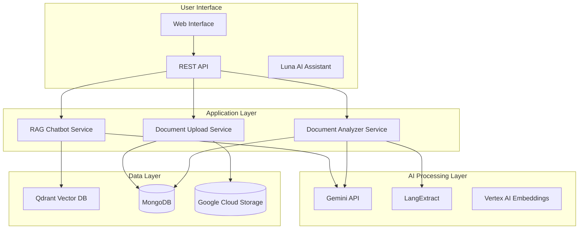

# Legal Clarity - AI-Powered Legal Document Analysis Platform

<div align="center">


**Demystifying legal documents through AI-powered analysis and intelligent insights**

[📖 Documentation](#documentation) • [🚀 Quick Start](#quick-start) • [🔧 API Reference](#api-reference) • [🤝 Contributing](#contributing)

</div>

---

## 🎯 What is Legal Clarity?

Legal Clarity is a comprehensive **AI-powered platform** that transforms complex legal documents into accessible, understandable information. Using cutting-edge AI technologies including **Google Gemini Flash** and **LangExtract**, the platform automatically analyzes legal documents and provides:

- **📋 Intelligent Document Analysis**: Automated extraction of key clauses, parties, and terms
- **⚠️ Risk Assessment**: Identification of potential legal and financial risks
- **✅ Compliance Checking**: Validation against Indian legal requirements
- **💰 Financial Analysis**: Extraction and analysis of monetary values and obligations
- **🔍 Smart Search**: Vector-based semantic search across legal documents
- **🤖 AI Assistant**: Conversational interface for legal queries

### 🎯 Supported Document Types

- **🏠 Rental Agreements**: Complete analysis of lease terms, property details, and tenant rights
- **💳 Loan Agreements**: Financial analysis, interest calculations, and compliance checks
- **📄 Terms of Service**: User rights, liability limitations, and dispute resolution terms

---

## 🏗️ Architecture Overview



### 🏗️ System Components

#### **1. Document Upload Service** (`Helper-APIs/document-upload-api/`)
- **Purpose**: Secure file upload and storage management
- **Features**: File validation, Google Cloud Storage integration, metadata management
- **Endpoints**: `/api/documents/upload`, `/api/documents/{id}`

#### **2. Document Analyzer Service** (`Helper-APIs/document-analyzer-api/`)
- **Purpose**: AI-powered legal document analysis
- **Features**: Entity extraction, risk assessment, compliance checking
- **Endpoints**: `/api/analyzer/analyze`, `/api/analyzer/results/{id}`, `/api/extractor/extract`

#### **3. RAG Chatbot Service** (`VectorDB Main/`)
- **Purpose**: Intelligent legal document Q&A system
- **Features**: Vector search, conversational AI, context awareness
- **Endpoints**: `/chat/query`, `/chat/history`

#### **4. Unified API Gateway** (`main.py`)
- **Purpose**: Single entry point for all services with consolidated routers
- **Features**: Router consolidation, CORS handling, health monitoring
- **Port**: 8001 (main consolidated API)
- **Endpoints**: 
  - Document upload: `/api/documents/*`
  - Document analysis: `/api/analyzer/*` 
  - Legal extraction: `/api/extractor/*`

---

## 🚀 Quick Start

### Prerequisites

- **Python 3.8+**
- **Google Cloud Project** with Gemini API enabled
- **MongoDB** database (local or Atlas)
- **Google Cloud Storage** bucket
- **Qdrant** vector database (optional)

### 1. Clone and Setup

```bash
# Clone the repository
git clone <repository-url>
cd legal-clarity

# Create virtual environment
python -m venv venv
source venv/bin/activate  # On Windows: venv\Scripts\activate

# Install dependencies
pip install -r requirements.txt
```

### 2. Environment Configuration

Create a `.env` file in the root directory:

```env
# Google Cloud Configuration
GEMINI_API_KEY=your_gemini_api_key_here
GEMINI_MODEL_FLASH=gemini-2.0-flash-exp
GOOGLE_PROJECT_ID=your_project_id
USER_DOC_BUCKET=your_gcs_bucket_name

# MongoDB Configuration
MONGO_URI=mongodb://localhost:27017
MONGO_DB=LegalClarity

# Qdrant Configuration (optional)
QDRANT_API_KEY=your_qdrant_key
QDRANT_HOST=https://your-qdrant-instance.com

# Application Configuration
DEBUG=true
LOG_LEVEL=INFO
API_HOST=0.0.0.0
API_PORT=8000
```

### 3. Start the Application

```bash
# Development mode
python main.py

# Or use uvicorn directly
uvicorn main:app --host 0.0.0.0 --port 8000 --reload
```

### 4. Access the API

The API will be available at:
- **Main Consolidated API**: http://localhost:8001
- **API Documentation**: http://localhost:8001/docs
- **Health Check**: http://localhost:8001/health

All services are now unified under a single API endpoint:

---

## 📚 API Reference

### 🔧 Core Endpoints

#### **Document Upload API**
```http
POST /api/documents/upload
Content-Type: multipart/form-data

# Upload a legal document
curl -X POST "http://localhost:8001/api/documents/upload?document_type=rental" \
     -F "file=@rental_agreement.pdf"
```

```http
GET /api/documents/{document_id}
# Retrieve document information
```

#### **Document Analyzer API**
```http
POST /api/analyzer/analyze
Content-Type: application/json

{
  "document_id": "doc_123456",
  "document_type": "rental",
  "user_id": "user_789"
}
```

```http
GET /api/analyzer/results/{document_id}?user_id=user_789
# Get analysis results
```

#### **Legal Extractor API**
```http
POST /api/extractor/extract
Content-Type: application/json

{
  "document_id": "doc_123456",
  "document_type": "rental",
  "user_id": "user_789"
}
```

```http
GET /api/extractor/results/{document_id}?user_id=user_789
# Get extraction results
```

#### **RAG Chatbot API**
```http
POST /chat/query
Content-Type: application/json

{
  "query": "What are the key terms in my rental agreement?",
  "document_id": "doc_123456",
  "user_id": "user_789"
}
```

### 📊 Response Format

All API responses follow a consistent format:

```json
{
  "success": true,
  "data": {
    // Response data
  },
  "meta": {
    "timestamp": "2025-09-18T10:30:00Z",
    "request_id": "req_123456"
  }
}
```

### ⚠️ Error Handling

```json
{
  "success": false,
  "error": {
    "message": "Document not found",
    "status_code": 404,
    "path": "/analyzer/results/doc_123",
    "method": "GET"
  },
  "meta": {
    "timestamp": "2025-09-18T10:30:00Z"
  }
}
```

---

## 📁 Project Structure

```
Legal-Clarity/
├── main.py                          # 🚀 Unified API entry point
├── requirements.txt                 # 📦 Python dependencies
├── service-account.json             # 🔐 Google Cloud credentials
├── .env                            # ⚙️ Environment configuration
│
├── Helper-APIs/                    # 🔧 API Services
│   ├── document-upload-api/        # 📤 Document upload service
│   │   ├── app/
│   │   │   ├── main.py            # Upload API application
│   │   │   ├── config.py          # Configuration
│   │   │   ├── database.py        # Database operations
│   │   │   ├── gcs_service.py     # Google Cloud Storage
│   │   │   └── routers/
│   │   │       └── documents.py   # Upload endpoints
│   │   └── requirements.txt       # Service dependencies
│   │
│   └── document-analyzer-api/      # 🤖 Document analyzer service
│       ├── app/
│       │   ├── main.py            # Analyzer API application
│       │   ├── config.py          # Configuration
│       │   ├── services/          # Business logic
│       │   │   ├── document_analyzer.py  # AI analysis service
│       │   │   ├── database_service.py   # MongoDB operations
│       │   │   └── gcs_service.py # Cloud storage
│       │   ├── routers/
│       │   │   └── analyzer.py    # Analysis endpoints
│       │   └── models/
│       │       └── schemas/       # Pydantic models
│       ├── tests/                 # Test suite
│       └── requirements.txt       # Service dependencies
│
├── VectorDB Main/                 # 🔍 RAG Chatbot service
│   ├── main.py                    # Chatbot application
│   ├── legal_rag_chatbot.py      # RAG implementation
│   ├── qdrant_vector_store.py    # Vector database
│   ├── gemini_legal_assistant.py # Gemini integration
│   └── requirements.txt          # Service dependencies
│
├── Rag Documents/                # 📄 Sample legal documents
│   ├── rental_agreement.pdf
│   ├── loan_agreement.pdf
│   └── terms_of_service.pdf
│
└── Memory Bank/                  # 📚 Documentation system
    ├── projectbrief.md           # Project vision
    ├── productContext.md         # User experience
    ├── techContext.md            # Technical architecture
    ├── systemPatterns.md         # Development standards
    ├── @architecture.md          # System blueprint
    ├── activeContext.md          # Current development status
    ├── progress.md               # Development roadmap
    └── memory_system.md          # LangMem architecture
```

---

## 🔧 Configuration

### Environment Variables

| Variable | Description | Required | Default |
|----------|-------------|----------|---------|
| `GEMINI_API_KEY` | Google Gemini API key | Yes | - |
| `MONGO_URI` | MongoDB connection string | Yes | - |
| `USER_DOC_BUCKET` | Google Cloud Storage bucket | Yes | - |
| `GOOGLE_PROJECT_ID` | Google Cloud project ID | Yes | - |
| `DEBUG` | Enable debug mode | No | `false` |
| `API_PORT` | API server port | No | `8000` |
| `LOG_LEVEL` | Logging level | No | `INFO` |

### Service Dependencies

#### Required Services
- **MongoDB**: Document metadata and analysis results storage
- **Google Cloud Storage**: Secure document storage
- **Google Gemini API**: AI-powered document analysis

#### Optional Services
- **Qdrant**: Vector database for semantic search
- **Redis**: Caching and session management

---

## 🧪 Testing

### Run All Tests

```bash
# Install test dependencies
pip install pytest pytest-asyncio httpx

# Run document analyzer tests
cd Helper-APIs/document-analyzer-api
python -m pytest tests/ -v

# Run integration tests
python test_integration.py
```

### Test Coverage

The test suite covers:
- ✅ **API Endpoints**: All REST endpoints functionality
- ✅ **Service Layer**: Business logic and external integrations
- ✅ **Data Models**: Pydantic schema validation
- ✅ **Error Handling**: Comprehensive error scenarios
- ✅ **Integration**: End-to-end functionality

---

## 🚀 Deployment

### Docker Deployment

```dockerfile
# Dockerfile
FROM python:3.9-slim

WORKDIR /app
COPY requirements.txt .
RUN pip install -r requirements.txt

COPY . .
EXPOSE 8000

CMD ["uvicorn", "main:app", "--host", "0.0.0.0", "--port", "8000"]
```

```bash
# Build and run
docker build -t legal-clarity .
docker run -p 8000:8000 legal-clarity
```

### Google Cloud Run Deployment

```bash
# Deploy to Cloud Run
gcloud run deploy legal-clarity \
  --source . \
  --platform managed \
  --region asia-south1 \
  --allow-unauthenticated
```

### Production Checklist

- [ ] Set up Google Cloud credentials securely
- [ ] Configure production MongoDB instance
- [ ] Enable Google Cloud Storage bucket
- [ ] Set up monitoring and logging
- [ ] Configure rate limiting and security
- [ ] Set up CI/CD pipeline

---

## 📈 Performance & Scaling

### Benchmarks

- **API Response Time**: <2 seconds for standard queries
- **Document Analysis**: 30-90 seconds per document
- **Concurrent Users**: Supports 50+ simultaneous analyses
- **Storage**: Handles documents up to 10MB
- **Vector Search**: <500ms query response time

### Scaling Strategies

#### Horizontal Scaling
```python
# Auto-scaling configuration
app = FastAPI()
# Configure with multiple workers
uvicorn.run("main:app", host="0.0.0.0", port=8000, workers=4)
```

#### Database Scaling
- **MongoDB**: Replica sets for high availability
- **Qdrant**: Clustering for distributed vector search
- **Redis**: Master-slave replication for caching

#### Performance Optimization
- **Async Operations**: All I/O operations are asynchronous
- **Background Processing**: Document analysis runs in background
- **Caching**: Redis caching for frequently accessed data
- **Connection Pooling**: Efficient database connection management

---

## 🔒 Security

### Data Protection

- **Encryption**: End-to-end encryption for all data
- **Secure Storage**: Google Cloud Storage with encryption at rest
- **API Security**: JWT-based authentication (planned)
- **Input Validation**: Comprehensive input sanitization
- **Rate Limiting**: Protection against abuse (planned)

### Compliance

- **GDPR**: European data protection compliance
- **Indian IT Act**: Compliance with Information Technology Act, 2000
- **Audit Logging**: Comprehensive audit trails
- **Access Control**: Role-based access management (planned)

---

## 🤝 Contributing

### Development Workflow

1. **Fork the repository**
2. **Create a feature branch**
   ```bash
   git checkout -b feature/your-feature-name
   ```
3. **Make your changes**
4. **Add tests** for new functionality
5. **Run the test suite**
   ```bash
   python -m pytest tests/ -v
   ```
6. **Update documentation** if needed
7. **Commit your changes**
   ```bash
   git commit -m "Add: Your feature description"
   ```
8. **Push to your branch**
   ```bash
   git push origin feature/your-feature-name
   ```
9. **Create a Pull Request**

### Code Standards

- **Python**: PEP 8 compliance
- **Type Hints**: Comprehensive type annotations
- **Documentation**: Google-style docstrings
- **Testing**: Minimum 80% test coverage
- **Linting**: Black formatter and flake8

### Documentation Updates

When making changes:
- Update the relevant Memory Bank files
- Add API documentation for new endpoints
- Update this README if needed
- Include examples and usage instructions

---

## 📊 Monitoring & Analytics

### Key Metrics

- **API Performance**: Response times, error rates, throughput
- **Document Processing**: Success rates, processing times, accuracy
- **User Engagement**: Query volume, document uploads, feature usage
- **AI Service Usage**: API calls, token consumption, costs

### Logging

```python
# Structured logging
import logging

logger = logging.getLogger(__name__)
logger.info("Document processed", extra={
    "document_id": "doc_123",
    "processing_time": 45.2,
    "status": "success"
})
```

### Health Checks

```bash
# Health endpoint
GET /health

# Service-specific health
GET /analyzer/health
GET /documents/health
```

---

## 🐛 Troubleshooting

### Common Issues

#### 1. Import Errors
```bash
# Install missing dependencies
pip install -r requirements.txt

# Check Python version
python --version  # Should be 3.8+
```

#### 2. Google Cloud Errors
```bash
# Verify credentials
export GOOGLE_APPLICATION_CREDENTIALS="service-account.json"

# Check API key
echo $GEMINI_API_KEY
```

#### 3. Database Connection Issues
```bash
# Test MongoDB connection
python -c "from pymongo import MongoClient; client = MongoClient('your_uri'); print(client.list_database_names())"
```

#### 4. Memory Issues
```bash
# Monitor memory usage
python -c "import psutil; print(f'Memory: {psutil.virtual_memory().percent}%')"
```

### Debug Mode

Enable debug logging:
```bash
export LOG_LEVEL=DEBUG
python main.py
```

---

## 📋 Roadmap

### ✅ Completed Features

- [x] **Document Upload API** - File upload with GCS integration
- [x] **Document Analyzer API** - AI-powered legal analysis
- [x] **RAG Chatbot System** - Intelligent legal Q&A
- [x] **Unified API Gateway** - Single entry point for all services
- [x] **MongoDB Integration** - Document metadata and analysis storage
- [x] **Google Cloud Storage** - Secure document storage
- [x] **Comprehensive Testing** - Full test coverage

### 🔄 In Progress

- [ ] **Luna AI Assistant** - Conversational AI personality
- [ ] **Authentication System** - JWT-based security
- [ ] **Interactive Document Viewer** - PDF annotation capabilities
- [ ] **Analytics Dashboard** - User insights and reporting

### 📋 Planned Features

- [ ] **Multi-language Support** - Hindi and regional language processing
- [ ] **Mobile Application** - iOS and Android apps
- [ ] **Enterprise Features** - Collaboration and team management
- [ ] **Advanced AI Features** - Predictive legal analytics
- [ ] **Blockchain Integration** - Smart contract analysis

---

## 📞 Support

### Getting Help

1. **Check the Documentation**: Review this README and API docs
2. **Search Issues**: Check existing GitHub issues
3. **Create an Issue**: Report bugs or request features
4. **Community**: Join our Discord/Slack community

### Contact Information

- **Email**: support@legalclarity.com
- **Documentation**: https://docs.legalclarity.com
- **API Reference**: https://api.legalclarity.com/docs

---

## 📄 License

This project is licensed under the MIT License - see the [LICENSE](LICENSE) file for details.

---

## 🙏 Acknowledgments

- **Google Gemini Team** for the powerful AI models
- **LangExtract Contributors** for the document extraction library
- **FastAPI Community** for the excellent web framework
- **MongoDB Team** for the robust database solution

---

<div align="center">

**Made with ❤️ for legal clarity and accessibility**

[⭐ Star us on GitHub](https://github.com/your-org/legal-clarity) •
[🐛 Report Issues](https://github.com/your-org/legal-clarity/issues) •
[📖 Documentation](https://docs.legalclarity.com)

</div>