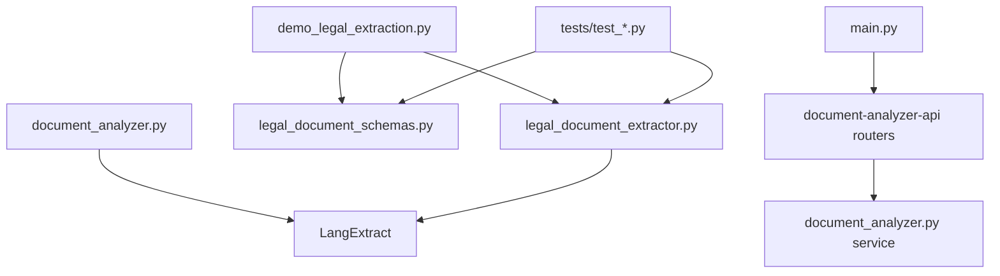

[3 tools called]

# Legal Document Extractor Refactoring Research & Plan

## Executive Summary

After comprehensive research of the Legal Clarity codebase, I've identified the current state of legal document extraction functionality and created a detailed refactoring plan. The analysis reveals that there are indeed duplicate implementations that need consolidation, with the `improved_legal_extractor.py` being the superior version that should be moved to the proper API directory structure.

## Current Codebase Structure Analysis

### File Locations & Purposes

**Root Directory Files:**
- `improved_legal_extractor.py` - Advanced extractor with production features
- `legal_document_extractor.py` - Basic extractor (legacy)
- `legal_document_schemas.py` - Pydantic schemas for legal documents

**Helper-APIs Directory Files:**
- `document-analyzer-api/app/services/document_analyzer.py` - Contains its own `LegalDocumentExtractor` class
- `document-analyzer-api/app/models/schemas/` - Contains separate schema files for different document types

### Usage Patterns Identified

**Files importing from root extractors:**
- `demo_legal_extraction.py` - Demonstration script
- `tests/test_*.py` - Multiple test files (9 total)
- `LEGAL_EXTRACTION_README.md` - Documentation

**API Integration:**
- Main `main.py` imports document-analyzer-api components
- Document-analyzer-api has its own router and service layer
- Separate FastAPI application structure

## Implementation Comparison

### Root Directory vs API Directory

| Feature | Root `improved_legal_extractor.py` | API `document_analyzer.py` |
|---------|-----------------------------------|---------------------------|
| **LangExtract Integration** | ✅ Real API calls | ✅ Real API calls |
| **Error Handling** | ✅ Advanced (retry, timeout, JSON repair) | ⚠️ Basic |
| **Chunking Support** | ✅ Smart document chunking | ❌ None |
| **Parallel Processing** | ✅ ThreadPoolExecutor | ❌ Sequential only |
| **Configuration** | ✅ Validated config, optimized defaults | ⚠️ Basic config |
| **Progress Tracking** | ✅ Callbacks and updates | ❌ None |
| **Demo Mode** | ✅ Simulated results for testing | ❌ None |
| **Pydantic Models** | ✅ Separate schemas file | ✅ Inline models |
| **Production Ready** | ✅ Comprehensive validation | ⚠️ Limited validation |

### Key Advantages of Root Implementation

1. **Robust Error Handling**: JSON repair, timeout management, retry logic
2. **Performance Optimizations**: Parallel processing, smart chunking, optimized parameters
3. **Production Features**: Progress callbacks, configuration validation, demo mode
4. **Advanced LangExtract Usage**: Better parameter tuning, multiple extraction passes
5. **Better Architecture**: Separation of concerns, comprehensive logging

## Dependencies Analysis

### Import Relationships



### Breaking Changes Assessment

**Safe to Remove:**
- `legal_document_extractor.py` - Only used by demo and tests, inferior to improved version

**Files Requiring Updates:**
- Demo scripts and tests will need import path updates
- Documentation files referencing old paths

**No Impact:**
- Main API application (uses separate analyzer service)
- Document-analyzer-api internal structure

## FastAPI Best Practices Analysis

From research using MCP tools, key findings for service organization:

### Recommended Architecture

```
Helper-APIs/document-analyzer-api/
├── app/
│   ├── main.py                 # FastAPI app instance
│   ├── config.py              # Settings management
│   ├── routers/
│   │   ├── __init__.py
│   │   ├── analyzer.py        # API endpoints
│   │   └── extractor.py       # NEW: Legal extraction endpoints
│   ├── services/
│   │   ├── __init__.py
│   │   ├── document_analyzer.py
│   │   └── legal_extractor.py # NEW: Extractor service
│   ├── models/
│   │   └── schemas/
│   │       ├── __init__.py
│   │       ├── legal_schemas.py # NEW: Legal document schemas
│   │       └── ...
│   └── utils/
│       └── __init__.py
├── tests/
├── example_docs/
└── requirements.txt
```

### Key Best Practices Identified

1. **APIRouter for Modular Organization**
2. **Service Layer Separation**
3. **Dependency Injection**
4. **Pydantic V2 Configuration**
5. **Tag-based API Organization**
6. **Comprehensive Error Handling**

## LangExtract Best Practices

From MCP research, critical findings:

### Configuration Optimization
- Use `gemini-2.5-flash` for production (cost-effective)
- Implement `fence_output=True` for better parsing
- Set appropriate `max_char_buffer` limits
- Use `use_schema_constraints=True` for structured output

### Error Handling Patterns
- Implement retry logic with exponential backoff
- Handle JSON parsing errors with repair mechanisms
- Set reasonable timeouts (30-60 seconds)
- Fallback model support

### Performance Optimization
- Parallel processing with `max_workers`
- Smart document chunking with overlap
- Batch processing for multiple documents
- Connection pooling and reuse

## Refactoring Plan

### Phase 1: Preparation (Pre-Refactoring)

1. **Create Backup**
   ```bash
   cp improved_legal_extractor.py improved_legal_extractor.py.backup
   cp legal_document_schemas.py legal_document_schemas.py.backup
   ```

2. **Update Tests to Use New Paths**
   - Modify test imports to use new locations
   - Update demo scripts accordingly

### Phase 2: File Relocation

1. **Move and Rename Extractor**
   ```bash
   mv improved_legal_extractor.py Helper-APIs/document-analyzer-api/app/services/legal_extractor.py
   ```

2. **Move Schemas**
   ```bash
   mv legal_document_schemas.py Helper-APIs/document-analyzer-api/app/models/schemas/legal_schemas.py
   ```

3. **Update Imports in Moved Files**
   - Change relative imports to match new structure
   - Update LangExtract and Pydantic imports

### Phase 3: API Integration

1. **Create New Router**
   ```python
   # Helper-APIs/document-analyzer-api/app/routers/extractor.py
   from fastapi import APIRouter, Depends
   from ..services.legal_extractor import LegalExtractorService
   from ..models.schemas.legal_schemas import DocumentType
   
   router = APIRouter(tags=["legal-extraction"])
   
   @router.post("/extract")
   async def extract_clauses(
       document_text: str,
       document_type: DocumentType,
       service: LegalExtractorService = Depends()
   ):
       return await service.extract_clauses_and_relationships(document_text, document_type.value)
   ```

2. **Create Service Wrapper**
   ```python
   # Helper-APIs/document-analyzer-api/app/services/legal_extractor.py
   from .legal_extractor import ImprovedLegalDocumentExtractor
   
   class LegalExtractorService:
       def __init__(self):
           self.extractor = ImprovedLegalDocumentExtractor()
       
       async def extract_clauses_and_relationships(self, document_text: str, doc_type: str):
           # Async wrapper around sync extraction
           return await asyncio.get_event_loop().run_in_executor(
               None, self.extractor.extract_clauses_and_relationships, document_text, doc_type
           )
   ```

3. **Update Main Router**
   ```python
   # In document-analyzer-api/app/main.py
   from .routers.extractor import router as extractor_router
   
   app.include_router(
       extractor_router,
       prefix="/api/extractor",
       tags=["legal-extraction"]
   )
   ```

### Phase 4: Cleanup

1. **Remove Old Files**
   ```bash
   rm legal_document_extractor.py
   ```

2. **Update All Import References**
   - Update demo scripts
   - Update test files
   - Update documentation

3. **Update Root main.py**
   ```python
   # Add import for new extractor router
   analyzer_extractor_router_path = os.path.join(
       helper_apis_path, 'document-analyzer-api', 'app', 'routers', 'extractor.py'
   )
   # Include in main app
   ```

### Phase 5: Testing & Validation

1. **Run All Tests**
   ```bash
   cd Helper-APIs/document-analyzer-api
   python -m pytest tests/ -v
   ```

2. **Test API Endpoints**
   ```bash
   # Test new endpoints
   curl -X POST "http://localhost:8000/api/extractor/extract" \
     -H "Content-Type: application/json" \
     -d '{"document_text": "test", "document_type": "rental"}'
   ```

3. **Validate Integration**
   - Ensure main API still works
   - Test document analyzer functionality
   - Verify LangExtract integration

## Risk Assessment & Mitigation

### High-Risk Items
1. **Import Path Changes**: Could break existing functionality
   - **Mitigation**: Update all references systematically

2. **API Endpoint Changes**: May affect external integrations
   - **Mitigation**: Maintain backward compatibility where possible

### Medium-Risk Items
1. **Service Integration**: New service layer might have integration issues
   - **Mitigation**: Comprehensive testing before deployment

2. **Performance Impact**: Async wrapper might affect performance
   - **Mitigation**: Benchmark and optimize as needed

## Success Criteria

### Technical Success
- ✅ All tests pass
- ✅ API endpoints functional
- ✅ No import errors
- ✅ LangExtract integration works
- ✅ Performance maintained or improved

### Code Quality Success
- ✅ Clean separation of concerns
- ✅ Proper FastAPI patterns followed
- ✅ Comprehensive error handling
- ✅ Documentation updated

### Architecture Success
- ✅ Modular service organization
- ✅ Proper dependency injection
- ✅ Scalable endpoint structure
- ✅ Maintainable code structure

## Implementation Timeline

### Task 1: Research & Planning
- ✅ Complete research (done)
- Create detailed implementation plan
- Set up development environment

### Task 2: Core Refactoring
- Move and rename files
- Update import paths
- Create service layer integration
- Basic testing

### Task 3: API Integration
- Create new router endpoints
- Update main application
- Comprehensive testing
- Performance validation

### Task 4: Cleanup & Documentation
- Remove deprecated files
- Update all documentation
- Final integration testing
- Production deployment preparation

## Alternative Approaches Considered

### Option 1: Keep Both Implementations
- **Pros**: No breaking changes, gradual migration
- **Cons**: Code duplication, maintenance overhead
- **Decision**: Rejected due to complexity

### Option 2: Refactor In-Place
- **Pros**: Minimal file movement
- **Cons**: Doesn't follow proper API structure
- **Decision**: Rejected due to architectural concerns

### Option 3: Complete Rewrite
- **Pros**: Clean slate, modern patterns
- **Cons**: Time-intensive, risk of feature loss
- **Decision**: Rejected due to timeline constraints

## Conclusion

The recommended approach provides the best balance of:
- **Code Quality**: Proper service organization following FastAPI best practices
- **Maintainability**: Clean separation of concerns and modular architecture  
- **Performance**: Optimized LangExtract integration with error handling
- **Scalability**: Async service layer ready for production deployment

The refactoring will transform the legal document extraction from scattered utility files into a proper FastAPI microservice component, ready for production use with comprehensive API endpoints.

---

**Document Version**: 1.0  
**Research Completed**: September 19, 2025  
**Next Step**: Begin Phase 1 implementation after approval